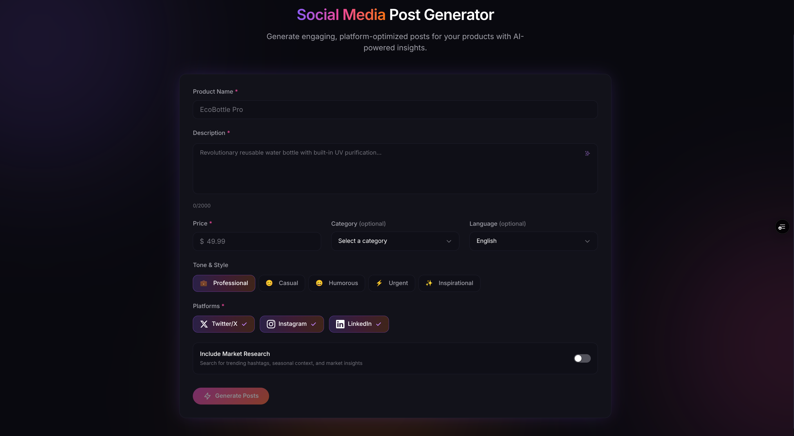

# Social Media Post Generator

AI-powered social media content generator that creates engaging, platform-optimized posts for Twitter/X, Instagram, and LinkedIn.



## Features

- **AI-Powered Generation** - Uses OpenAI GPT-4o to generate platform-optimized posts
- **AI Description Generator** - Auto-generate product descriptions with one click
- **Multi-Language Support** - Generate posts in 13 languages (English, Spanish, French, German, Italian, Portuguese, Dutch, Polish, Lithuanian, Ukrainian, Chinese, Japanese, Korean)
- **Tone Customization** - 5 tone options (Professional, Casual, Humorous, Urgent, Inspirational)
- **Platform Selection** - Generate for Twitter/X, Instagram, and/or LinkedIn
- **Web Research** - Optional market research for trending hashtags and seasonal context
- **Dark Theme UI** - Modern design with gradient accents
- **Copy to Clipboard** - One-click copy for each generated post
- **Responsive Design** - Optimized for desktop and mobile

## Tech Stack

| Category | Technology |
|----------|------------|
| **Framework** | Next.js 16 (App Router, Server Actions) |
| **Language** | TypeScript 5 |
| **UI Library** | Chakra UI v3 |
| **State Management** | Valtio |
| **AI** | OpenAI API (GPT-4o) |
| **Validation** | Zod 4 |
| **Runtime** | Bun |
| **Styling** | Emotion |
| **Fonts** | Space Grotesk, DM Sans |

## Getting Started

### Prerequisites

- Node.js 18+ or Bun
- OpenAI API key

### Installation

```bash
# Clone the repository
git clone https://github.com/kstulgys/social-posts-generator.git
cd social-posts-generator

# Install dependencies
bun install

# Set up environment variables
cp .env.example .env
# Edit .env and add your OPENAI_API_KEY

# Run development server
bun dev
```

Visit http://localhost:3000

### Environment Variables

| Variable | Description | Required |
|----------|-------------|----------|
| `OPENAI_API_KEY` | Your OpenAI API key | Yes |
| `NEXT_PUBLIC_APP_URL` | Production URL for metadata | No |

## Scripts

```bash
bun dev      # Start development server
bun build    # Create production build
bun start    # Start production server
```

## Project Structure

```
src/
├── actions/              # Server actions
│   └── generate.ts       # Post & description generation
├── app/
│   ├── page.tsx          # Main page
│   ├── layout.tsx        # Root layout with fonts & metadata
│   └── globals.css       # Global styles
├── components/
│   ├── ui/               # Reusable UI components (Input, Select, etc.)
│   ├── icons/            # SVG icon components
│   └── PostCard.tsx      # Post display card
├── features/
│   └── generator/        # Generator feature components
│       └── components/   # ToneSelector, PlatformSelector, etc.
├── stores/
│   └── generator.ts      # Valtio state management
├── lib/
│   ├── config.ts         # App configuration
│   ├── generate.ts       # Post generation logic
│   ├── openai.ts         # OpenAI client
│   ├── theme.ts          # Chakra UI theme
│   ├── types.ts          # Type definitions
│   ├── validation.ts     # Zod schemas
│   └── webResearch.ts    # Web research logic
├── types/                # Shared TypeScript types
├── constants/            # App constants
└── utils/                # Utility functions
```

## Deployment

### Vercel (Recommended)

1. Push to GitHub
2. Import to Vercel
3. Add `OPENAI_API_KEY` environment variable
4. Deploy

### Other Platforms

The app can be deployed to any platform that supports Next.js:
- Netlify
- Railway
- Docker
- Self-hosted

## License

MIT
